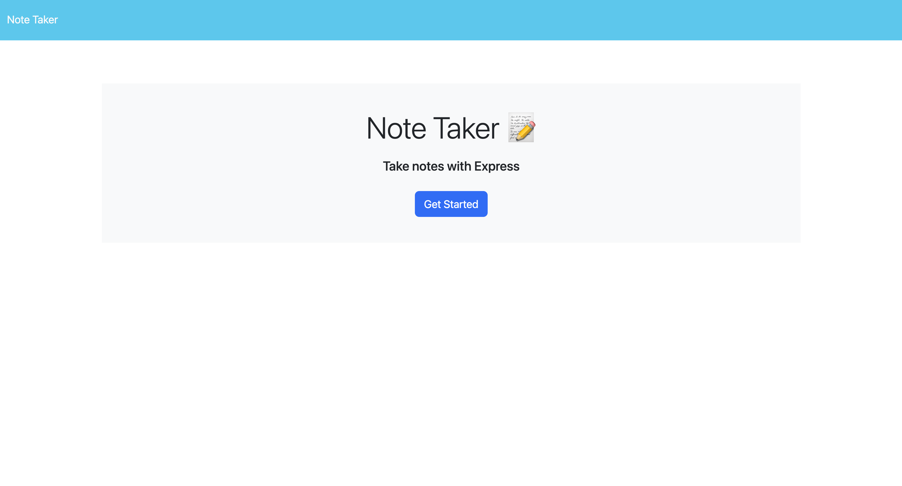

# Note Taker

Deployed on [Railway](https://railway.app/):

- https://mr-polkadot-note-taker.up.railway.app/

## Description

In this application, you can save notes as well as delete them. The project was created using **HTML**, **CSS**, **JAVASCRIPT**, **NODEJS**, **EXPRESS JS** as well as other packages used in nodejs. With express js, a server was created to locally host a deploy the application.

## Installation

Must have node js and the packages needed installed on your system.

## Contributing

Any contributions are welcome!

## Tests

You can use postman to run tests on the routes. I used [Insomnia](https://insomnia.rest/) in my situation. If you do a git clone, type npm i on the terminal and then nodemon server.js. The server will deploy and run the application.

## Credits

Useful links:

- [Handling Delete Request -Youtube](https://youtu.be/00NNuZHF56A?si=l5cJC1gGSpbF3JgV)
- [Node.js and Express.js Full course -Youtube](https://youtu.be/Oe421EPjeBE?si=N8sgHj4y9XnKzKex)

  ## Contact-Me

  You can contact me through my Github account and email:

  - GitHub username: [MrPolkadot](github.com/MrPolkadot)
  - Email: ceballos93@gmail.com
